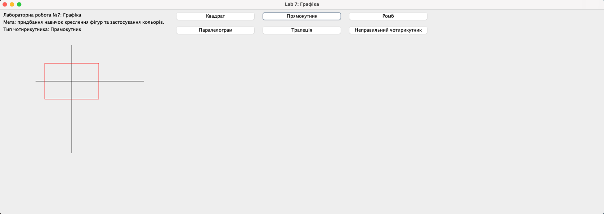
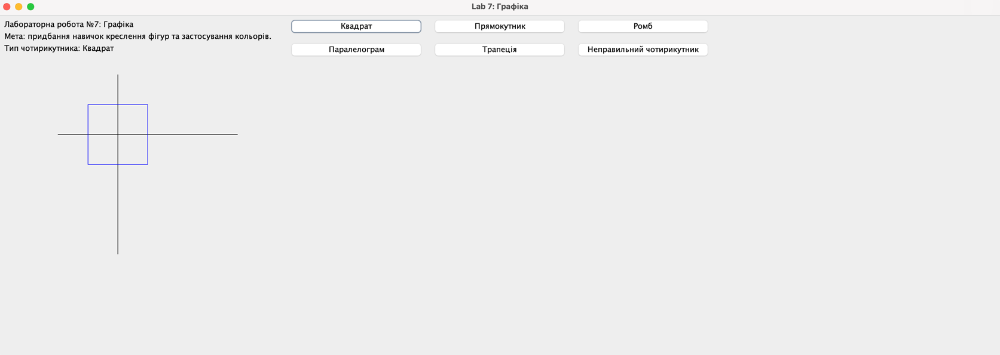

# Лабораторна робота № 7 Графіка. Java

## Мета лабораторної роботи –
Придбання навичок креслення різноманітних фігур, застосування кольорів та текстів.

## Виконання лабораторної роботи
Для кожного варіанта накреслити на екрані всі координат, необхідні геометричні фігури, а також вивести текст завдання та текст відповіді.

## Варіанти завдань
1. Опуклий чотирикутник заданий довжинами сторін і кутами. Визначити вид
   чотирикутника (квадрат, ромб, трапеція, …)...

## Висновок: 
На цій лабораторній роботі придбав навички креслення різноманітних фігур, застосування кольорів та текстів.

**Результат:**

Лінк на [ГуглДокумент звіту](https://docs.google.com/document/d/1SEP5Wckn1fkrSeFDJoks7PApIWHReiTLpNgV8loGwSY/edit?usp=sharing).
